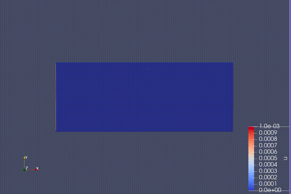

# LatticeBoltmanzSimulation

This is a group project for High End Simulation Progmming course in FAU-Erlangen/Nürnberg in which we implemented a parallel programmed Lattice Boltzman fluid simulation OpenCL. The original homework is developed in Ubuntu OS with CUDA and NVIDIA GPUs. However, I converted the code to run in XCode 11.4 with OpenCL 1.2 in a Intel Iris Plus Graphics 640 GPU.

## Requirements
- [XCode 11.4](https://developer.apple.com/documentation/xcode-release-notes/xcode-11_4-release-notes).
- [OpenCL 1.2](https://developer.apple.com/opencl/)
- [Paraview](https://www.paraview.org)

## Simulation
- The simulation takes an command line parameter for inlet velocity. In the example output files, the results are generated with inlet velocity = 0.001.
- After the successful completion of the simulation, there will be .vtk files generated which then should be opened with the Paraview software.
- In the Paraview, in the Coloring section the parameter "u" should be selected to see the velocities.

## References
- Calculations are taken [from](https://www.math.nyu.edu/~billbao/report930.pdf).

## To Dos
- In the original project, we also included some additional objects inside the simulation domain. This feature is also going to be added.

## Contributors
- Gabriel Stankiewicz
- Mohammad Moataz
